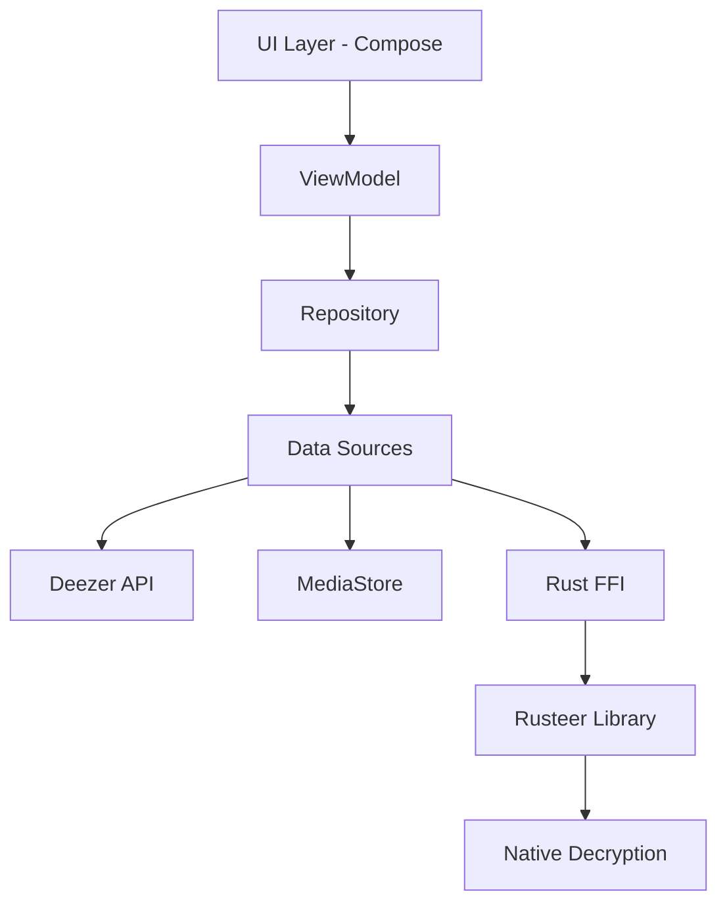
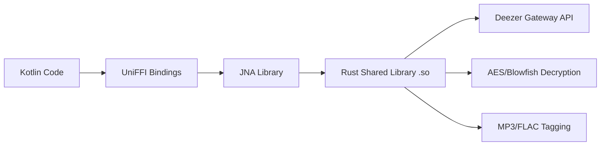

## Architecture Pattern

Deeztracker Mobile follows the **MVVM (Model-View-ViewModel)** architecture pattern with **repository pattern** for data management and **Jetpack Compose** for declarative UI.



---

## Layer Architecture

### UI Layer (Jetpack Compose)

The UI layer is built entirely with **Jetpack Compose** using Material 3 design system.

<AccordionGroup>
  <Accordion title="Screens" icon="desktop">
    Located in `ui/screens/`, screens are composable functions that represent full-page views:
    
    - `LoginScreen.kt` - Deezer ARL authentication
    - `LocalMusicScreen.kt` - Offline music library
    - `DownloadsScreen.kt` - Download management
    - `AlbumScreen.kt` - Album details and track listing
    - `ArtistScreen.kt` - Artist profile and discography
    - `PlaylistScreen.kt` - Playlist details
    - `LyricsScreen.kt` - Synchronized lyrics viewer
    - `ImportPlaylistScreen.kt` - Playlist import from Deezer
    
    Each screen observes state from its corresponding ViewModel using `StateFlow`.
  </Accordion>

  <Accordion title="Components" icon="puzzle-piece">
    Reusable UI components in `ui/components/`:
    
    - `TrackArtwork.kt` - Album art display with fallback
    - `AlphabeticalFastScroller.kt` - Fast scroll for long lists
    - `MarqueeText.kt` - Auto-scrolling text for long titles
    - `TrackDetailsDialog.kt` - Track metadata viewer
    - `AddToPlaylistBottomSheet.kt` - Playlist selection sheet
    - `CreatePlaylistDialog.kt` - New playlist creation
    - `EditTrackDialog.kt` - Metadata editor
    - `TrackPreviewButton.kt` - 30-second preview player
  </Accordion>

  <Accordion title="Theme" icon="palette">
    Material 3 theming in `ui/theme/`:
    
    ```kotlin ui/theme/Theme.kt
    @Composable
    fun DeezTrackerTheme(
        darkTheme: Boolean = isSystemInDarkTheme(),
        content: @Composable () -> Unit
    ) {
        val colorScheme = if (darkTheme) darkColorScheme() else lightColorScheme()
        
        MaterialTheme(
            colorScheme = colorScheme,
            typography = Typography,
            content = content
        )
    }
    ```
    
    Supports light/dark modes with dynamic color schemes.
  </Accordion>
</AccordionGroup>

---

## ViewModel Layer

ViewModels manage UI state and business logic using **Kotlin Coroutines** and **Flow**.

### ViewModel Pattern

All ViewModels follow this structure:

```kotlin Example: AlbumViewModel.kt
class AlbumViewModel(
    private val repository: DeezerRepository = DeezerRepository()
) : ViewModel() {
    
    // Mutable state (private)
    private val _album = MutableStateFlow<Album?>(null)
    private val _tracks = MutableStateFlow<List<Track>>(emptyList())
    private val _isLoading = MutableStateFlow(false)
    
    // Exposed immutable state
    val album: StateFlow<Album?> = _album
    val tracks: StateFlow<List<Track>> = _tracks
    val isLoading: StateFlow<Boolean> = _isLoading
    
    fun loadAlbum(albumId: Long) {
        viewModelScope.launch {
            _isLoading.value = true
            try {
                val albumData = repository.getAlbum(albumId)
                _album.value = albumData
                
                val tracksResponse = repository.getAlbumTracks(albumId)
                _tracks.value = tracksResponse.data
            } catch (e: Exception) {
                e.printStackTrace()
            } finally {
                _isLoading.value = false
            }
        }
    }
}
```

**Key ViewModels**:

<CardGroup cols={2}>
  <Card title="AlbumViewModel" icon="record-vinyl">
    - Loads album metadata
    - Fetches track listing
    - Manages download state
    
    `ui/screens/AlbumViewModel.kt`
  </Card>
  
  <Card title="ArtistViewModel" icon="user-music">
    - Artist profile data
    - Top tracks
    - Album discography
    
    `ui/screens/ArtistViewModel.kt`
  </Card>
  
  <Card title="LocalMusicViewModel" icon="folder-music">
    - MediaStore scanning
    - Track/album/artist grouping
    - Local playlist management
    
    `ui/screens/LocalMusicViewModel.kt`
  </Card>
  
  <Card title="DownloadsViewModel" icon="download">
    - Downloaded tracks list
    - File management
    - Share/delete operations
    
    `ui/screens/DownloadsViewModel.kt`
  </Card>
</CardGroup>

---

## Repository Pattern

Repositories abstract data sources and provide clean APIs to ViewModels.

### DeezerRepository

Handles all Deezer API interactions using **Retrofit**:

```kotlin features/deezer/DeezerRepository.kt
class DeezerRepository {
    private val api = DeezerNetwork.api
    
    suspend fun searchTracks(query: String, next: String? = null): TrackSearchResponse {
        return if (next != null) api.searchTracksByUrl(next) 
               else api.searchTracks(query)
    }
    
    suspend fun getAlbum(id: Long) = api.getAlbum(id)
    suspend fun getAlbumTracks(id: Long) = api.getAlbumTracks(id)
    suspend fun getArtist(id: Long) = api.getArtist(id)
    suspend fun getPlaylist(id: Long) = api.getPlaylist(id)
    // ...
}
```

**Base URL**: `https://api.deezer.com/`

**Key endpoints**:
- `GET /search/track?q={query}` - Search tracks
- `GET /album/{id}` - Get album metadata
- `GET /album/{id}/tracks` - Get album tracks
- `GET /artist/{id}` - Get artist info
- `GET /playlist/{id}` - Get playlist details

### LocalMusicRepository

Manages local music library using **Android MediaStore**:

```kotlin features/localmusic/LocalMusicRepository.kt
class LocalMusicRepository(private val contentResolver: ContentResolver) {
    
    suspend fun getAllTracks(): List<LocalTrack> = withContext(Dispatchers.IO) {
        val tracks = mutableListOf<LocalTrack>()
        val uri = MediaStore.Audio.Media.EXTERNAL_CONTENT_URI
        val projection = arrayOf(
            MediaStore.Audio.Media._ID,
            MediaStore.Audio.Media.TITLE,
            MediaStore.Audio.Media.ARTIST,
            MediaStore.Audio.Media.ALBUM,
            MediaStore.Audio.Media.DATA,
            MediaStore.Audio.Media.DURATION,
            MediaStore.Audio.Media.ALBUM_ID
        )
        
        contentResolver.query(uri, projection, null, null, null)?.use { cursor ->
            while (cursor.moveToNext()) {
                tracks.add(LocalTrack(
                    id = cursor.getLong(0),
                    title = cursor.getString(1),
                    artist = cursor.getString(2),
                    album = cursor.getString(3),
                    filePath = cursor.getString(4),
                    duration = cursor.getLong(5),
                    albumArtUri = getAlbumArt(cursor.getLong(6))
                ))
            }
        }
        
        tracks
    }
}
```

### LocalPlaylistRepository

Manages custom playlists using **SharedPreferences** with JSON serialization:

```kotlin features/localmusic/LocalPlaylistRepository.kt
class LocalPlaylistRepository(context: Context) {
    private val prefs = context.getSharedPreferences("playlists", Context.MODE_PRIVATE)
    
    private val _playlists = MutableStateFlow<List<LocalPlaylist>>(emptyList())
    val playlists: StateFlow<List<LocalPlaylist>> = _playlists.asStateFlow()
    
    suspend fun createPlaylist(name: String, trackIds: List<Long> = emptyList()) {
        // Creates a new playlist with unique ID
    }
    
    suspend fun addTrackToPlaylist(playlistId: String, trackId: Long) {
        // Adds track to existing playlist
    }
    
    suspend fun isFavorite(trackId: Long): Boolean {
        // Checks if track is in Favorites playlist
    }
}
```

---

## Rust FFI Integration (UniFFI)

Deeztracker uses **UniFFI** to bridge Rust and Kotlin for performance-critical download operations.

### Architecture



### RustDeezerService

Kotlin wrapper around the Rust library:

```kotlin features/rusteer/RustDeezerService.kt
class RustDeezerService(context: Context) {
    private val service = RusteerService()  // UniFFI generated class
    private val prefs: SharedPreferences = context.getSharedPreferences(
        "rusteer_prefs", Context.MODE_PRIVATE
    )
    
    suspend fun login(arl: String): Boolean = withContext(Dispatchers.IO) {
        val isValid = service.verifyArl(arl)
        if (isValid) {
            prefs.edit().putString(KEY_ARL, arl).apply()
        }
        isValid
    }
    
    suspend fun downloadTrack(
        trackId: String,
        outputDir: String,
        quality: DownloadQuality
    ): DownloadResult = withContext(Dispatchers.IO) {
        val arl = getSavedArl() ?: throw IllegalStateException("Not logged in")
        service.downloadTrack(arl, trackId, outputDir, quality)
    }
    
    suspend fun downloadAlbum(
        albumId: String,
        outputDir: String,
        quality: DownloadQuality
    ): BatchDownloadResult = withContext(Dispatchers.IO) {
        val arl = getSavedArl() ?: throw IllegalStateException("Not logged in")
        service.downloadAlbum(arl, albumId, outputDir, quality)
    }
}
```

### Rusteer Library Structure

The Rust library (`rusteer/`) provides:

<CardGroup cols={2}>
  <Card title="API Clients" icon="globe">
    - `DeezerApi` - Public metadata API
    - `GatewayApi` - Private download API with ARL auth
    
    `rusteer/src/api/`
  </Card>
  
  <Card title="Cryptography" icon="lock">
    - Blowfish decryption for track data
    - AES decryption for metadata
    - MD5/SHA1 hashing
    
    `rusteer/src/crypto/`
  </Card>
  
  <Card title="Audio Tagging" icon="tag">
    - ID3 tag writing (MP3)
    - FLAC metadata embedding
    - Album art injection
    
    `rusteer/src/tagging.rs`
  </Card>
  
  <Card title="UniFFI Bindings" icon="link">
    - Kotlin interface generation
    - Type conversion (Rust ↔ Kotlin)
    - Error handling
    
    `rusteer/src/bindings.rs`
  </Card>
</CardGroup>

**UniFFI Definition** (`rusteer/src/rusteer.udl`):

```udl
namespace rusteer {
    RusteerService new();
};

interface RusteerService {
    boolean verify_arl(string arl);
    [Throws=DeezerError]
    DownloadResult download_track(string arl, string track_id, string output_dir, DownloadQuality quality);
    [Throws=DeezerError]
    BatchDownloadResult download_album(string arl, string album_id, string output_dir, DownloadQuality quality);
};

enum DownloadQuality {
    "FLAC",
    "MP3_320",
    "MP3_128",
};
```

---

## Media Playback (Media3)

Deeztracker uses **AndroidX Media3** (ExoPlayer) for audio playback with a foreground service.

### PlayerController

Singleton controller managing playback state:

```kotlin features/player/PlayerController.kt
class PlayerController(private val context: Context) {
    
    companion object {
        @Volatile
        private var INSTANCE: PlayerController? = null
        
        fun getInstance(context: Context): PlayerController {
            return INSTANCE ?: synchronized(this) {
                PlayerController(context.applicationContext).also { INSTANCE = it }
            }
        }
    }
    
    private val _playerState = MutableStateFlow(PlayerState())
    val playerState: StateFlow<PlayerState> = _playerState.asStateFlow()
    
    private var mediaController: MediaController? = null
    
    fun playTrack(track: LocalTrack, playlist: List<LocalTrack>, source: String? = null) {
        currentPlaylist = playlist
        val startIndex = playlist.indexOfFirst { it.id == track.id }
        
        val mediaItems = playlist.map { localTrack ->
            MediaItem.Builder()
                .setUri(Uri.fromFile(File(localTrack.filePath)))
                .setMediaId(localTrack.id.toString())
                .setMediaMetadata(
                    MediaMetadata.Builder()
                        .setTitle(localTrack.title)
                        .setArtist(localTrack.artist)
                        .setAlbumTitle(localTrack.album)
                        .setArtworkUri(artworkUri)
                        .build()
                )
                .build()
        }
        
        mediaController?.setMediaItems(mediaItems, startIndex, 0L)
        mediaController?.prepare()
        mediaController?.play()
    }
    
    fun togglePlayPause() {
        mediaController?.let {
            if (it.isPlaying) it.pause() else it.play()
        }
    }
    
    fun toggleRepeatMode() {
        val newMode = when (mediaController?.repeatMode) {
            Player.REPEAT_MODE_OFF -> Player.REPEAT_MODE_ALL
            Player.REPEAT_MODE_ALL -> Player.REPEAT_MODE_ONE
            Player.REPEAT_MODE_ONE -> Player.REPEAT_MODE_OFF
            else -> Player.REPEAT_MODE_OFF
        }
        mediaController?.repeatMode = newMode
    }
}
```

### MusicService

Foreground service implementing `MediaSessionService`:

```kotlin features/player/MusicService.kt
class MusicService : MediaSessionService() {
    private var mediaSession: MediaSession? = null
    private lateinit var player: ExoPlayer
    
    override fun onCreate() {
        super.onCreate()
        
        player = ExoPlayer.Builder(this)
            .setAudioAttributes(AudioAttributes.DEFAULT, true)
            .setHandleAudioBecomingNoisy(true)
            .build()
        
        mediaSession = MediaSession.Builder(this, player)
            .setCallback(MediaSessionCallback())
            .build()
    }
    
    override fun onGetSession(controllerInfo: MediaSession.ControllerInfo): MediaSession? {
        return mediaSession
    }
}
```

**Features**:
- Background playback with notification controls
- Lock screen media controls
- Bluetooth/headphone integration
- Audio focus management

---

## Navigation Architecture

Deeztracker uses **Jetpack Navigation Compose** for declarative navigation.

### Navigation Graph

```kotlin navigation/AppNavigation.kt
@Composable
fun AppNavigation() {
    val navController = rememberNavController()
    val context = LocalContext.current
    val rustService = remember { RustDeezerService(context) }
    val startDestination = if (rustService.isLoggedIn()) "main" else "login"
    
    NavHost(navController = navController, startDestination = startDestination) {
        composable("login") {
            LoginScreen(onLoginSuccess = {
                navController.navigate("main") {
                    popUpTo("login") { inclusive = true }
                }
            })
        }
        
        composable("main") {
            MainScreen(
                onArtistClick = { artistId -> navController.navigate("artist/$artistId") },
                onAlbumClick = { albumId -> navController.navigate("album/$albumId") },
                onPlaylistClick = { playlistId -> navController.navigate("playlist/$playlistId") },
                onLogout = {
                    PlayerController.getInstance(context).stop()
                    navController.navigate("login") {
                        popUpTo("main") { inclusive = true }
                    }
                }
            )
        }
        
        composable(
            route = "artist/{artistId}",
            arguments = listOf(navArgument("artistId") { type = NavType.LongType })
        ) { backStackEntry ->
            val artistId = backStackEntry.arguments?.getLong("artistId") ?: return@composable
            ArtistScreen(
                artistId = artistId,
                onBackClick = { navController.popBackStack() },
                onAlbumClick = { albumId -> navController.navigate("album/$albumId") }
            )
        }
        
        composable(
            route = "album/{albumId}",
            arguments = listOf(navArgument("albumId") { type = NavType.LongType })
        ) { backStackEntry ->
            val albumId = backStackEntry.arguments?.getLong("albumId") ?: return@composable
            AlbumScreen(
                albumId = albumId,
                onBackClick = { navController.popBackStack() }
            )
        }
    }
}
```

**Routes**:
- `login` - Authentication screen
- `main` - Main app with bottom navigation (Search, Local Music, Downloads, Playlists, Settings)
- `artist/{artistId}` - Artist detail page
- `album/{albumId}` - Album detail page
- `playlist/{playlistId}` - Playlist detail page
- `import_playlist` - Playlist import screen

---

## State Management with Flow

All reactive state uses **Kotlin Flow** for type-safe, lifecycle-aware updates.

### StateFlow Pattern

```kotlin
// In Repository/ViewModel
private val _state = MutableStateFlow<DataType>(initialValue)
val state: StateFlow<DataType> = _state.asStateFlow()  // Read-only exposure

// In Composable
val state by viewModel.state.collectAsState()
```

### DownloadManager State Example

```kotlin features/download/DownloadManager.kt
class DownloadManager {
    private val _downloadState = MutableStateFlow<DownloadState>(DownloadState.Idle)
    val downloadState: StateFlow<DownloadState> = _downloadState.asStateFlow()
    
    private val _downloadRefreshTrigger = MutableStateFlow(0)
    val downloadRefreshTrigger: StateFlow<Int> = _downloadRefreshTrigger.asStateFlow()
    
    private suspend fun processRequest(request: DownloadRequest) {
        _downloadState.value = DownloadState.Downloading(
            type = DownloadType.TRACK,
            title = request.title,
            itemId = request.id.toString()
        )
        
        try {
            val result = rustService.downloadTrack(...)
            _downloadState.value = DownloadState.Completed(
                type = DownloadType.TRACK,
                title = request.title,
                successCount = 1
            )
            _downloadRefreshTrigger.value += 1  // Trigger UI refresh
        } catch (e: Exception) {
            _downloadState.value = DownloadState.Error(
                title = request.title,
                message = e.message ?: "Unknown error"
            )
        }
    }
}
```

---

## Dependency Injection

Currently uses **manual dependency injection** with singleton patterns.

### Key Singletons

```kotlin
// PlayerController
val playerController = PlayerController.getInstance(context)

// DownloadManager
val downloadManager = DownloadManager.getInstance(context)

// RustDeezerService
val rustService = RustDeezerService(context)
```

<Note>
The project doesn't use Hilt/Dagger. Dependencies are injected manually via constructors or singleton `getInstance()` methods.
</Note>

---

## Dependencies Overview

### Core Android

```kotlin app/build.gradle.kts:76-85
implementation("androidx.core:core-ktx:1.12.0")
implementation("androidx.lifecycle:lifecycle-runtime-ktx:2.7.0")
implementation("androidx.lifecycle:lifecycle-viewmodel-ktx:2.7.0")
implementation("androidx.activity:activity-compose:1.8.2")
implementation(platform("androidx.compose:compose-bom:2023.08.00"))
implementation("androidx.compose.ui:ui")
implementation("androidx.compose.material3:material3")
implementation("androidx.compose.material:material-icons-extended:1.5.4")
```

### Media & Playback

```kotlin app/build.gradle.kts:88-91
implementation("androidx.media3:media3-exoplayer:1.2.0")
implementation("androidx.media3:media3-session:1.2.0")
implementation("androidx.media3:media3-ui:1.2.0")
```

### Networking

```kotlin app/build.gradle.kts:99-102
implementation("com.squareup.retrofit2:retrofit:2.9.0")
implementation("com.squareup.retrofit2:converter-gson:2.9.0")
implementation("com.squareup.okhttp3:logging-interceptor:4.12.0")
```

### FFI & Native

```kotlin app/build.gradle.kts:96-97
implementation("net.java.dev.jna:jna:5.14.0@aar")  // UniFFI dependency
```

### Other

```kotlin app/build.gradle.kts:105-114
implementation("androidx.navigation:navigation-compose:2.7.6")  // Navigation
implementation("io.coil-kt:coil-compose:2.5.0")  // Image loading
implementation("net.jthink:jaudiotagger:3.0.1")  // Audio metadata
implementation("androidx.core:core-splashscreen:1.0.1")  // Splash screen
```

---

## Next Steps

<CardGroup cols={2}>
  <Card title="Project Structure" icon="folder-tree" href="/development/project-structure">
    Explore the detailed directory layout and file organization
  </Card>
  
  <Card title="Building from Source" icon="hammer" href="/development/building">
    Learn how to build and run the application
  </Card>
</CardGroup>